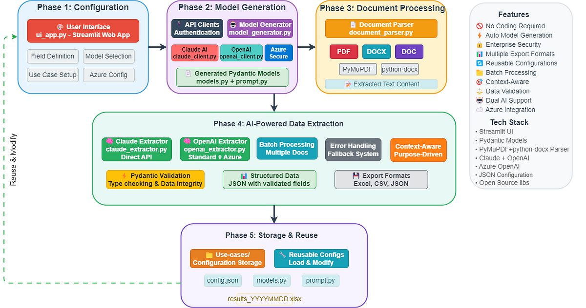

# Knowledge Extraction AI Agent

## Overview

The **Knowledge Extraction AI Agent** is a powerful, generic AI-powered application that allows organizations to create their own knowledge extraction use cases without requiring any coding expertise. This intelligent system automatically generates sophisticated Pydantic data models based on plain language descriptions of extraction requirements, making structured data extraction accessible to non-technical users.



### Key Features

🤖 **No-Code Model Generation**: Describe your extraction needs in plain language, and the AI automatically creates optimized Pydantic models  
🔒 **Azure Integration**: Secure data processing through Microsoft Azure endpoints for confidential organizational documents  
📋 **Multi-Format Support**: Extract data from PDF, DOCX, and DOC documents  
⚡ **Dual AI Engine**: Choose between Claude AI and OpenAI GPT models for both model generation and data extraction  
🎯 **Context-Aware Extraction**: Specify extraction purpose and document types for enhanced accuracy  
📊 **Multiple Export Formats**: Download results in Excel, CSV, or JSON formats  
🔧 **Reusable Configurations**: Save and reuse extraction models across different document batches

## Why Choose This Solution?

### For Organizations
- **Confidentiality**: Azure endpoint integration ensures your sensitive documents are processed securely within Microsoft's enterprise infrastructure
- **Scalability**: Process individual documents or entire folders with batch extraction capabilities
- **Compliance**: Maintain data governance standards with on-premises-style security through Azure
- **Cost-Effective**: Eliminate the need for custom development teams or expensive data extraction solutions

### For Technical Teams
- **Rapid Deployment**: Get extraction pipelines running in minutes, not weeks
- **Model Flexibility**: Dynamic Pydantic model generation adapts to any extraction schema
- **API Integration Ready**: Built with modular architecture for easy integration into existing workflows
- **Extensible Framework**: Add new document types and extraction methods with minimal effort

## Application Workflow

### 1. Configuration Phase
1. **Use Case Definition**: Name your extraction project (e.g., "Resume Analysis", "Invoice Processing")
2. **Field Specification**: Describe what data you want to extract using natural language
3. **Model Generation**: AI automatically creates optimized Pydantic models with proper validation
4. **Context Configuration**: Set extraction purpose, document types, and custom instructions
5. **Configuration Persistence**: Save your setup for future use across document batches

### 2. Extraction Phase
1. **Configuration Loading**: Select from saved extraction configurations
2. **Document Selection**: Upload files individually or select entire folders
3. **Model Selection**: Choose between Claude AI and OpenAI for extraction processing
4. **Security Configuration**: Enable Azure endpoint for confidential document processing
5. **Batch Processing**: Extract data from multiple documents simultaneously
6. **Results Export**: Download structured data in your preferred format

### 3. Model Architecture

The application uses a sophisticated three-layer architecture:

- **Presentation Layer**: Streamlit-based web interface for intuitive user interaction
- **Processing Layer**: AI-powered model generation and document parsing engines
- **Data Layer**: Dynamic Pydantic model creation with validation and structured output

## Installation

### Prerequisites

- Python 3.8 or higher
- Required API keys (see Configuration section)

### Quick Start

1. **Clone the Repository**
   ```bash
   git clone https://github.com/umairalipathan1980/A-Generic-Knowledge-Extraction-AI-Agent.git
   cd A-Generic-Knowledge-Extraction-AI-Agent
   ```

2. **Create Virtual Environment**
   ```bash
   python -m venv venv
   source venv/bin/activate  # On Windows: venv\\Scripts\\activate
   ```

3. **Install Dependencies**
   ```bash
   pip install -r requirements.txt
   ```

4. **Configure Environment Variables**
   ```bash
   cp .env.example .env
   # Edit .env file with your API keys (see Configuration section)
   ```

5. **Launch Application**
   ```bash
   streamlit run ui_app.py
   ```

6. **Access Interface**
   Open your browser to `http://localhost:8501`

## Configuration

### API Keys Setup

Create a `.env` file in the project root with the following variables:

```env
# Claude AI Configuration
CLAUDE_API_KEY=your_claude_api_key_here

# OpenAI Configuration (Standard)
OPENAI_API_KEY=your_openai_api_key_here

# Azure OpenAI Configuration (Optional - for secure processing)
AZURE_API_KEY=your_azure_openai_api_key_here
```

### API Key Acquisition

1. **Claude AI**: Get your API key from [Anthropic Console](https://console.anthropic.com/)
2. **OpenAI**: Obtain your API key from [OpenAI Platform](https://platform.openai.com/api-keys)
3. **Azure OpenAI**: Contact your Azure administrator or set up through [Azure Portal](https://portal.azure.com/)

### Azure Endpoint Configuration

For organizations requiring secure document processing:

1. **Enable Azure Processing**: Toggle "Use Microsoft Azure Endpoint" in the application interface
2. **Model Compatibility**: Azure mode requires OpenAI models for extraction (Claude can still be used for model generation)
3. **Security Benefits**: Documents are processed within Microsoft's enterprise infrastructure
4. **Compliance**: Meets enterprise security and data governance requirements

## Usage Guide

### Creating Your First Extraction Model

1. **Navigate to Configuration Tab**
2. **Define Use Case**:
   - Enter a descriptive name (e.g., "Employee Resume Analysis")
   - Add a brief description of what you're extracting
   - Specify the main model name (auto-generated or custom)

3. **Configure Extraction Fields (Example)**:
   ```
   Field Name: "name"
   Field Description: "name of the person in resume"
   Categories/Classes (Optional): [Leave empty for simple text]
   Data Type: str
   
   Field Name: "skills" 
   Field Description: "person's skillset"
   Categories/Classes (Optional): [Leave empty for simple text or write a comma separated list of specific skills you want to extract]
   Data Type: str
   
   Field Name: "Industry"
   Field Description: "industry or domain the person belongs to"
   Categories/Classes (Optional): [You can mention a list of categories you want to extract, e.g., Healthcare & wellbeing, Automotive, Construction, ...]


   Field Name: "Education"
   Field Description: "person's highest education"
   Categories/Classes (Optional): [[You can mention a list of categories you want to extract, e.g., Bachelors, Masters, PhD, ...]

   ```

4. **Set Model Preferences**:
   - **Model Generation**: Choose between Claude or OpenAI for creating Pydantic models
   - **Extraction Engine**: Select the AI model for document processing
   - **Azure Integration**: Enable for secure organizational document processing

5. **Save Configuration**: Your model is now ready for use across multiple document batches

### Running Extractions

1. **Load Saved Configuration**: Select from your previously created models
2. **Specify Extraction Context**:
   - **Purpose**: "Extract candidate information for hiring pipeline"
   - **Document Type**: "Resumes and CVs"
   - **Custom Instructions**: "Focus on recent experience and technical skills"

3. **Select Documents**:
   - **Individual Upload**: Choose specific PDF/DOCX files
   - **Folder Processing**: Select entire directories for batch processing

4. **Execute Extraction**: Click "Start Extraction" and monitor progress
5. **Download Results**: Export data in Excel, CSV, or JSON format

### Advanced Features

#### Custom Field Types
- **String Fields**: Names, descriptions, free-text responses
- **Enumerated Fields**: Predefined categories with validation
- **List Fields**: Multiple values (skills, locations, etc.)
- **Numeric Fields**: Integers, floats with validation ranges

#### Batch Processing
- Process hundreds of documents simultaneously
- Progress tracking and error handling
- Automatic retry mechanisms for failed extractions

#### Result Management
- Structured data validation using generated Pydantic models
- Error reporting and fallback handling
- Metadata preservation (file names, processing timestamps)

## Project Structure

```
knowledge-extraction-agent/
├── README.md                 # Comprehensive project documentation
├── .env.example             # Environment variables template
├── setup.sh                 # Linux/Mac setup script
├── setup.bat                # Windows setup script
├── requirements.txt         # Python dependencies
├── ui_app.py                # Main Streamlit web application
├── model_generator.py       # AI-powered Pydantic model generation
├── claude_extractor.py      # Claude AI extraction engine
├── openai_extractor.py      # OpenAI extraction engine
├── document_parser.py       # Multi-format document processing
├── claude_client.py         # Claude API client
├── openai_client.py         # OpenAI API client
├── Use-cases/               # Saved extraction configurations
│   ├── Use_Case_1/          # Example extraction configuration
│   │   ├── config.json      # Use case configuration
│   │   ├── models.py        # Generated Pydantic models
│   │   └── prompt.py        # Generated extraction prompts
│   ├── Use_Case_2/          # Another example configuration
│   │   ├── config.json      # Use case configuration
│   │   ├── models.py        # Generated Pydantic models
│   │   └── prompt.py        # Generated extraction prompts
│   └── Use_Case_N/          # Additional configurations...
│       ├── config.json      # Use case configuration
│       ├── models.py        # Generated Pydantic models
│       └── prompt.py        # Generated extraction prompts
└── images/                  # Documentation images and assets
```

### Key Files Explained

- **`ui_app.py`**: Main Streamlit web interface for configuration and extraction
- **`model_generator.py`**: Core AI engine that generates Pydantic models from plain language descriptions
- **`*_extractor.py`**: AI-powered extraction engines supporting both Claude and OpenAI
- **`*_client.py`**: API clients for Claude and OpenAI services
- **`document_parser.py`**: Handles parsing of PDF, DOCX, and DOC files
- **`Use-cases/*/config.json`**: Persistent storage of extraction configurations
- **`Use-cases/*/models.py`**: Auto-generated Pydantic models for data validation
- **`Use-cases/*/prompt.py`**: Auto-generated extraction prompts with embedded models
- **`.env.example`**: Template for API keys and environment variables
- **`setup.*`**: Automated setup scripts for different operating systems

## Example Use Cases

### Business Applications
- **HR & Recruitment**: Resume parsing, candidate evaluation, skills assessment
- **Financial Services**: Invoice processing, contract analysis, compliance reporting
- **Legal**: Document review, clause extraction, regulatory analysis
- **Healthcare**: Medical record analysis, insurance claim processing
- **Research**: Academic paper analysis, literature reviews, data synthesis

### Technical Applications
- **Data Migration**: Legacy system data extraction and transformation
- **Content Management**: Document classification and metadata extraction
- **Compliance Monitoring**: Regulatory document analysis and reporting
- **Knowledge Management**: Information extraction from organizational documents

## Processing With Azure Endpoint

### Current Azure Integration

### Azure OpenAI Benefits
- **Enterprise Security**: SOC 2 Type II compliance and enterprise-grade security
- **Data Residency**: Control over data location and processing boundaries
- **Integration**: Seamless integration with existing Microsoft infrastructure
- **Compliance**: Meets regulatory requirements for sensitive document processing

This application currently supports **OpenAI models with Azure endpoint** when the Azure option is selected. Unlike GPT-* models, **Claude is not part of Azure OpenAI Service**. When you enable the Azure endpoint:

- **Model Generation**: Can use Claude (direct Anthropic API) or OpenAI (through Azure)
- **Data Extraction**: Limited to OpenAI models only (through Azure OpenAI Service)
- **Security**: Documents are processed within Microsoft's enterprise infrastructure

### Extending Claude Support with Azure

Unlike GPT-* models, Claude is not part of Azure OpenAI Service. However, you can integrate Claude separately, for example, using Azure Functions, Logic Apps, or third-party platforms like Pipedream or n8n that bridge Azure + Anthropic APIs. ou can also configure an external model endpoint in Databricks, pointing to Claude hosted externally (e.g., Anthropic API), and treat it like an OpenAI‑style model.

## Troubleshooting

### Common Issues

**Model Generation Failures**
- Ensure API keys are correctly configured in `.env`
- Check field descriptions are clear and specific
- Verify internet connectivity for AI model access

**Extraction Errors**
- Confirm document formats are supported (PDF, DOCX, DOC)
- Check document quality and text extractability
- Review extraction context for clarity

**Azure Endpoint Issues**
- Verify Azure API key configuration
- Ensure OpenAI model selection for extraction phase
- Check network connectivity to Azure services

### Performance Optimization

**Large Document Processing**
- Use batch processing for multiple documents
- Enable progress monitoring for long-running extractions
- Consider document pre-processing for complex layouts

**Memory Management**
- Process documents in smaller batches if memory constraints occur
- Monitor system resources during large-scale extractions

## Contributing

We welcome contributions to improve the Knowledge Extraction AI Agent! Please see our contribution guidelines:

1. **Fork the Repository**
2. **Create Feature Branch**: `git checkout -b feature/your-feature-name`
3. **Commit Changes**: `git commit -m 'Add some feature'`
4. **Push to Branch**: `git push origin feature/your-feature-name`
5. **Submit Pull Request**


## Support

For support and questions:
- **Issues**: [GitHub Issues](https://github.com/umairalipathan1980/A-Generic-Knowledge-Extraction-AI-Agent/issues)
- **Documentation**: [Wiki](https://github.com/umairalipathan1980/A-Generic-Knowledge-Extraction-AI-Agent/wiki)
- **Community**: [Discussions](https://github.com/umairalipathan1980/A-Generic-Knowledge-Extraction-AI-Agent/discussions)
---

**Ready to transform your document processing workflow? Get started in minutes with the Knowledge Extraction AI Agent!**